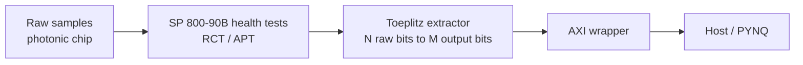

# qrng-postprocessing-fpga

Post-processing for a quantum random number generator (QRNG) on an InP photonic
integrated chip. It has two parts:
- `qrng_pp`, a Python reference pipeline;
- Verilog RTL for the FPGA: a Toeplitz randomness extractor,
  NIST SP 800-90B continuous health tests and an AXI wrapper.

Bachelor End Project. Design decisions are in [DECISIONS.md](DECISIONS.md), the
theory in [docs/THEORY.md](docs/THEORY.md) and lab/PYNQ procedures in
[docs/HOWTO.md](docs/HOWTO.md).

<!-- TODO: confirm stage order against docs/THEORY.md -->


## Install

```bash
python3 -m venv .venv && source .venv/bin/activate
pip install -r requirements.txt
```

The RTL simulation needs [Icarus Verilog](https://steveicarus.github.io/iverilog/) (`apt install iverilog`).

## Quick start

```bash
# Synthetic run
# TODO: command

# Lab data (from docs/HOWTO.md)
# TODO: python scripts/run_lab_data.py ...
```

## FPGA flow

```bash
make -C fpga sim                      # default parameters
make -C fpga sim N=1024 M=640 P=16    # configuration used in CI
```

`make sim` regenerates the test vectors in `fpga/vectors/`, which are not tracked.
The parameters are the extractor input length `N`, output length `M` and
datapath width `P`.
<!-- TODO: list the (N, M, P) constraints from fpga/Makefile / DECISIONS.md -->

## Verification status

- Python: `pytest` (65 checks)
- RTL: iverilog simulation via `fpga/Makefile`, checked against the Python model
  <!-- TODO: confirm bit-exact comparison -->

All results so far come from **synthetic data**. They show that the implementation
is consistent. They are **not** an entropy assessment or a security certification
of the physical source.

## Roadmap

- [ ] Characterise the source on real lab data
- [ ] Vivado synthesis and PYNQ bring-up

## License

MIT, see [LICENSE](LICENSE).
